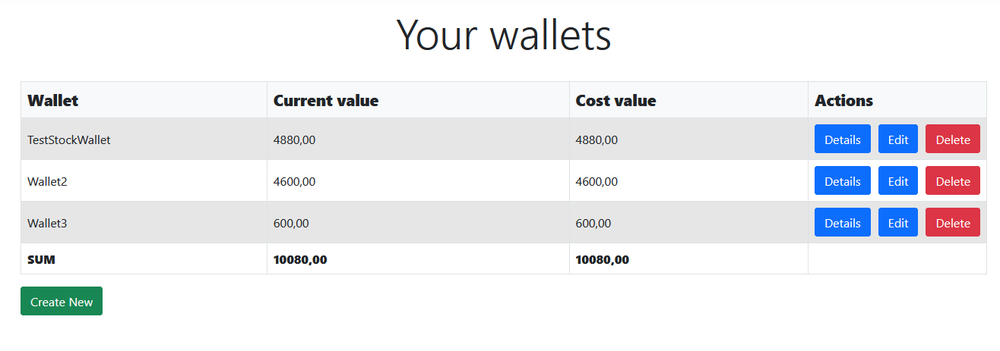
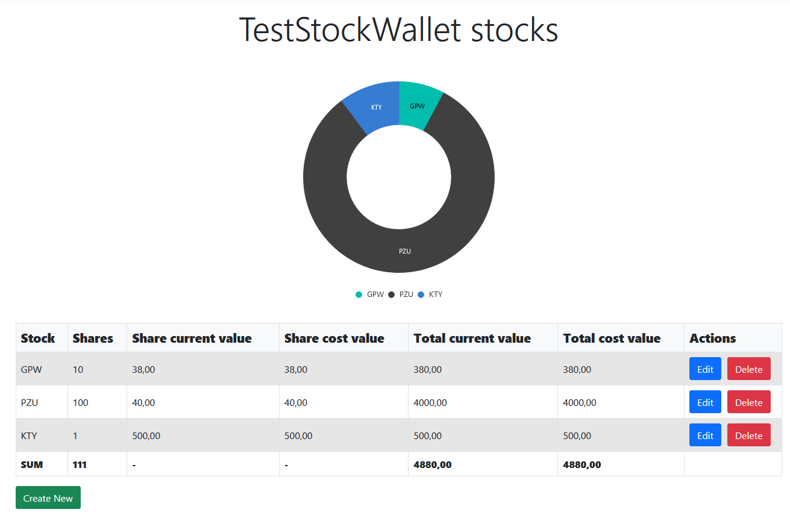

# stock-portfolio-tracker

This app will be simple stock portfolio tracker. Main functionality will cover basic CRUD operations for stocks and some summaries. At this moment it supports creating wallets, adding stocks to a wallet and showing those data in tables and (in case of specific wallet) in a graph. App is still in early stage of development (and it's my first ASP.NET project) so it may and will contain a lot of lacks and errors for now.

Here is current view for list of all wallets:

View for specific wallet:

